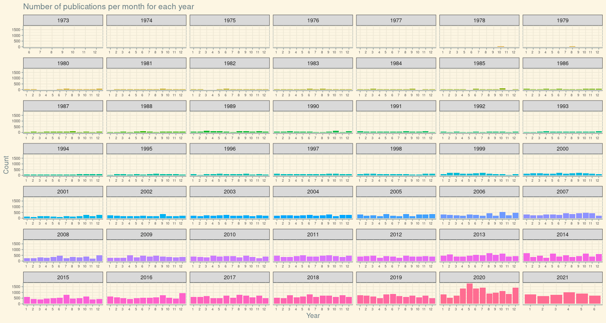

## Code

It is very much fun to work in R and visualizing the data. This is my first contribution to #Tidytuesday.


```r
# Get the Data

# Read in with tidytuesdayR package 
# Install from CRAN via: install.packages("tidytuesdayR")
# This loads the readme and all the datasets for the week of interest

# Either ISO-8601 date or year/week works!

setwd("/home/prakki/Documents/LeaRn/TidyTuesday/2021_week40")

library(tidyverse)
library(tidytuesdayR)
library(dplyr)

# Read in the data manually

# papers <- readr::read_csv('https://raw.githubusercontent.com/rfordatascience/tidytuesday/master/data/papers.csv')
# authors <- readr::read_csv('https://raw.githubusercontent.com/rfordatascience/tidytuesday/master/data/authors.csv')
# programs <- readr::read_csv('https://raw.githubusercontent.com/rfordatascience/tidytuesday/master/data/programs.csv')
# paper_authors <- readr::read_csv('https://raw.githubusercontent.com/rfordatascience/tidytuesday/master/data/paper_authors.csv')
# paper_programs <- readr::read_csv('https://raw.githubusercontent.com/rfordatascience/tidytuesday/master/data/paper_programs.csv')

# papers
# authors
# programs
# paper_authors
# paper_programs

library(nberwp)

# papers %>% 
#   write_csv("papers.csv")
# 
# authors %>% 
#   write_csv("authors.csv")
# 
# programs %>% 
#   write_csv("programs.csv")
# 
# paper_authors %>% 
#   write_csv('paper_authors.csv')
# 
# paper_programs %>% 
#   write_csv("paper_programs.csv")

joined_df <- left_join(papers, paper_authors) %>% 
  left_join(authors) %>% 
  left_join(paper_programs) %>% 
  left_join(programs)%>% 
  mutate(
    catalogue_group = str_sub(paper, 1, 1),
    catalogue_group = case_when(
      catalogue_group == "h" ~ "Historical",
      catalogue_group == "t" ~ "Technical",
      catalogue_group == "w" ~ "General"
    ),
    .after = paper
  ) 

head(joined_df)
```

```
## # A tibble: 6 x 12
##   paper catalogue_group  year month title author name  user_nber user_repec
##   <chr> <chr>           <int> <int> <chr> <chr>  <chr> <chr>     <chr>     
## 1 w0001 General          1973     6 Educ… w0001… Fini… finis_we… <NA>      
## 2 w0002 General          1973     6 Hosp… w0002… Barr… barry_ch… pch425    
## 3 w0003 General          1973     6 Erro… w0003… Swar… swarnjit… <NA>      
## 4 w0004 General          1973     7 Huma… w0004… Lee … <NA>      pli669    
## 5 w0005 General          1973     7 A Li… w0005… Jame… james_sm… psm28     
## 6 w0006 General          1973     7 A Re… w0006… Vict… victor_z… <NA>      
## # … with 3 more variables: program <chr>, program_desc <chr>,
## #   program_category <chr>
```

```r
tail(joined_df)
```

```
## # A tibble: 6 x 12
##   paper catalogue_group  year month title author name  user_nber user_repec
##   <chr> <chr>           <int> <int> <chr> <chr>  <chr> <chr>     <chr>     
## 1 h0132 Historical       2001     1 A Wo… h0132… Leon… <NA>      <NA>      
## 2 h0133 Historical       2001     4 What… h0090… John… john_wal… <NA>      
## 3 h0134 Historical       2001     7 The … h0002… Mich… michael_… pha740    
## 4 h0135 Historical       2001     8 The … h0071… Jose… joseph_f… <NA>      
## 5 h0136 Historical       2001    11 The … h0090… John… john_wal… <NA>      
## 6 h0137 Historical       2001    12 Shor… h0137… Howa… howard_b… <NA>      
## # … with 3 more variables: program <chr>, program_desc <chr>,
## #   program_category <chr>
```

```r
# levels(as.factor(joined_df$year))
# levels(as.factor(joined_df$catalogue_group))
# levels(as.factor(joined_df$month))
# levels(as.factor(joined_df$program))
# levels(as.factor(joined_df$program_desc))
# levels(as.factor(joined_df$program_category))
# levels(as.factor(joined_df$author))
# levels(as.factor(joined_df$user_nber))
# levels(as.factor(joined_df$user_repec))

# How many publications per year?

## Table
joined_df %>% count(year, sort=TRUE)
```

```
## # A tibble: 49 x 2
##     year     n
##    <int> <int>
##  1  2020 13217
##  2  2019  8064
##  3  2018  7820
##  4  2017  7469
##  5  2016  6874
##  6  2015  6108
##  7  2013  5960
##  8  2014  5754
##  9  2011  5108
## 10  2021  4917
## # … with 39 more rows
```

```r
## Plot
joined_df %>% count(year, sort=TRUE) %>% 
  ggplot(aes(x=factor(year),y=n)) +
  geom_bar(stat='identity') + 
 # ggthemes::theme_excel_new() +
  labs(x="Year",
       y="Count",
       title = "Number of publications per year")
```

<!-- -->

```r
ggsave("publication_per_year.png",height=10,width=20, unit="in")

# How many publications per year by catalogue group

## Table
joined_df %>% count(year,catalogue_group, sort=TRUE) 
```

```
## # A tibble: 91 x 3
##     year catalogue_group     n
##    <int> <chr>           <int>
##  1  2020 General         13217
##  2  2019 General          8064
##  3  2018 General          7820
##  4  2017 General          7469
##  5  2016 General          6874
##  6  2015 General          6108
##  7  2013 General          5960
##  8  2014 General          5754
##  9  2011 General          5108
## 10  2021 General          4917
## # … with 81 more rows
```

```r
## Plot
joined_df %>% count(year,catalogue_group, sort=TRUE) %>% 
  ggplot(aes(x=factor(year),y=n)) +
  geom_bar(stat='identity') +
  geom_col(aes(fill = catalogue_group))+
  labs(x="Year",
       y="Count",
       title = "Number of publications per year by catalogue group")
```

<!-- -->

```r
ggsave("publication_per_year_by_catalogue_group.png",height=10,width=20, unit="in")

# How many publications per year by program

## Table
joined_df %>% count(year,program, sort=TRUE) 
```

```
## # A tibble: 778 x 3
##     year program     n
##    <int> <chr>   <int>
##  1  2020 PE       1437
##  2  2020 LS       1322
##  3  2020 EFG      1286
##  4  2020 HE       1022
##  5  2019 LS        866
##  6  2018 LS        852
##  7  2019 PE        849
##  8  2016 LS        796
##  9  2018 PE        790
## 10  2020 CF        768
## # … with 768 more rows
```

```r
## Plot
joined_df %>% count(year,program, sort=TRUE) %>% 
  ggplot(aes(x=factor(year),y=n)) +
  geom_bar(stat='identity') +
  geom_col(aes(fill = program))+
  ggthemes::theme_excel_new() +
  labs(x="Year",
       y="Count",
       title = "Number of publications per year by program")
```

<!-- -->

```r
ggsave("publication_per_year_by_program_stacked.png",height=10,width=20, unit="in")

# Above plot, cannot clearly say which year has number of publications. Let's try facet_wrap

joined_df %>% count(year,program, sort=TRUE) %>% 
  ggplot(aes(x=factor(year),y=n)) +
  geom_bar(stat='identity') +
  geom_col(aes(fill = program))+
  facet_wrap(.~program,scales = "free_x") +
  ggthemes::theme_solarized()+
  labs(x="Year",
       y="Count",
       title = "Number of publications per year by program") +
  theme(
  #  panel.grid.major = element_blank(),
    axis.text.x = element_text(
      angle = 90,
      hjust = 1,
      size = 6
    ),
    axis.text.y = element_text(
      angle = 0,
      hjust = 1,
      size = 7
    ),
    legend.position = "none",
    strip.text.y.right = element_text(angle = 0),
    strip.text.x.top = element_text(angle = 0)
  )
```

<!-- -->

```r
ggsave("publication_per_year_by_program_facet.png",height=10,width=18, unit="in")

# How many authors have X number of publications?

## Table
joined_df %>% count(user_nber, sort=TRUE) %>% group_by(n) %>% summarise(author_count = n())
```

```
## # A tibble: 180 x 2
##        n author_count
##    <int>        <int>
##  1     1         3039
##  2     2         2897
##  3     3         1925
##  4     4         1244
##  5     5          829
##  6     6          561
##  7     7          428
##  8     8          335
##  9     9          267
## 10    10          237
## # … with 170 more rows
```

```r
# joined_df %>% count(user_nber, sort=TRUE) %>% filter(n==103)

# Plot
joined_df %>% count(user_nber, sort=TRUE) %>% group_by(n) %>% summarise(author_count = n()) %>% 
  ggplot(aes(x=factor(n),y=author_count)) +
  geom_bar(stat='identity') +
  ggthemes::theme_solarized() +
  labs(x="Number of Publications",
       y="Count of authors",
       title = "Count of authors with \"X\" number of publications") +
  theme(
      panel.grid.major = element_blank(),
    axis.text.x = element_text(
      angle = 90,
      hjust = 1,
      size = 6
    ),
    axis.text.y = element_text(
      angle = 0,
      hjust = 1,
      size = 7
    ),
    legend.position = "none",
    strip.text.y.right = element_text(angle = 0),
    strip.text.x.top = element_text(angle = 0)
  )
```

<!-- -->

```r
ggsave("publication_counts.png",height=6,width=14, unit="in")


# Which author had most number of publications

## Table
joined_df %>% count(user_nber, sort=TRUE) %>%  head(n = 50) %>%  tail()
```

```
## # A tibble: 6 x 2
##   user_nber           n
##   <chr>           <int>
## 1 rene_stulz        156
## 2 jeffrey_frankel   155
## 3 matthew_kahn      154
## 4 joseph_stiglitz   152
## 5 robert_barro      152
## 6 john_whalley      151
```

```r
# Plot 2

joined_df %>% count(user_nber, sort=TRUE) %>% head(n = 50) %>% filter(user_nber!="NA") %>% 
ggplot(aes(x=reorder(factor(user_nber),n),y=n, fill = user_nber, label = n)) +
  geom_bar(stat="identity", show.legend = FALSE) +
  coord_flip() +
  labs(x="Author", y="Count of Publications",
       title = "Top 50 authors with highest count of publications") +
  geom_label(aes(fill = user_nber),colour = "white", fontface = "bold", show.legend = FALSE) 
```

<!-- -->

```r
ggsave("author_with_mostpubs.png",height=10,width=9, unit="in")


# Which months had more number of publications per year

## Table
joined_df %>% count(year,month, sort=TRUE) 
```

```
## # A tibble: 576 x 3
##     year month     n
##    <int> <int> <int>
##  1  2020     5  1772
##  2  2020     7  1426
##  3  2020    12  1424
##  4  2020     4  1358
##  5  2020     6  1334
##  6  2020    10  1123
##  7  2021     4  1010
##  8  2020     9   962
##  9  2016    12   923
## 10  2020     8   905
## # … with 566 more rows
```

```r
# Plot 2

joined_df %>% count(year, month, sort=TRUE) %>% 
  ggplot(aes(x=factor(month),y=n)) +
  geom_bar(stat='identity') +
  geom_col(aes(fill = factor(year)))+
  facet_wrap(.~year,scales = "free_x") +
  ggthemes::theme_solarized()+
  labs(x="Year",
       y="Count",
       title = "Number of publications per month for each year") +
  theme(
   # panel.grid.major = element_blank(),
    axis.text.x = element_text(
      angle = 0,
      hjust = 1,
      size = 6
    ),
    axis.text.y = element_text(
      angle = 0,
      hjust = 1,
      size = 7
    ),
    legend.position = "none",
    strip.text.y.right = element_text(angle = 0),
    strip.text.x.top = element_text(angle = 0)
  )
```

<!-- -->

```r
ggsave("months_mostpubs_facet.png",height=10,width=18, unit="in")

# The above  does not obviously tell us which month had more publications

## Table
joined_df %>% count(month, sort=TRUE) 
```

```
## # A tibble: 12 x 2
##    month     n
##    <int> <int>
##  1     5 12102
##  2     6 12090
##  3    10 11234
##  4    12 11139
##  5     9 11044
##  6     1 11018
##  7     8 10883
##  8     7 10520
##  9     4 10465
## 10     3 10442
## 11     2  9606
## 12    11  9538
```

```r
# Plot 2
joined_df %>% count(month, sort=TRUE) %>%  
  ggplot(aes(x=reorder(factor(month),n),y=n, fill = factor(month), label = n)) +
  geom_bar(stat="identity", show.legend = FALSE) +
  #coord_flip() +
  labs(x="Month", y="Count of Publications",
       title = "Number of publications per month for each year") +
  geom_label(aes(fill = factor(month)),colour = "white", fontface = "bold", show.legend = FALSE) 
```

<!-- -->

```r
ggsave("months_mostpubs_bar.png",height=3,width=9, unit="in")
```

