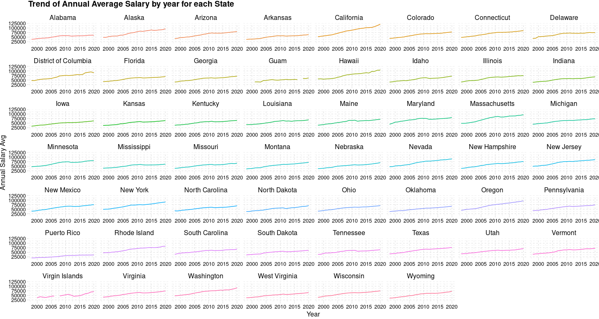
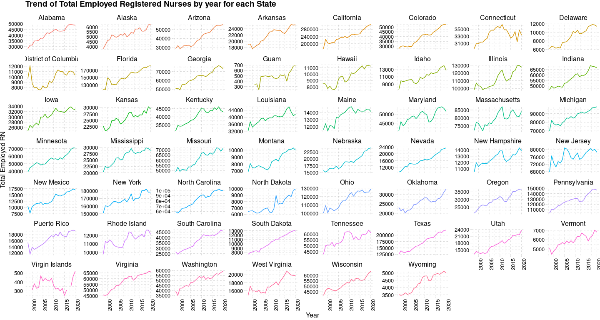
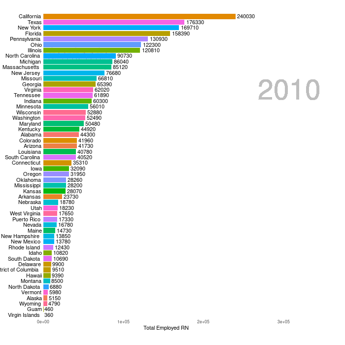

## Code

It is very much fun to work in R and visualizing the data. This is my 2nd contribution to #Tidytuesday.


```r
# Get the Data

# Read in with tidytuesdayR package 
# Install from CRAN via: install.packages("tidytuesdayR")
# This loads the readme and all the datasets for the week of interest

# Either ISO-8601 date or year/week works!

# Or read in the data manually

nurses <- readr::read_csv('https://raw.githubusercontent.com/rfordatascience/tidytuesday/master/data/2021/2021-10-05/nurses.csv')
#View(nurses)

library(tidyverse)
library(dplyr)
library(ggplot2)
library(gganimate)
library(animation)
library(magick)


nurses %>% filter(if_any(everything(), ~ !is.na(.))) %>%
  select(State, `Hourly Wage Avg`, `Total Employed RN`, `Annual Salary Avg`, Year) %>%
  ggplot(aes(x=Year,y=`Annual Salary Avg`, color=State)) +
  geom_line() +
  facet_wrap(~State,scales = "free_x") +
  ggthemes::theme_pander() +
  theme(legend.position = "none") +
  labs(title = "Trend of Annual Average Salary by year for each State")
```

```
## Warning: Removed 3 row(s) containing missing values (geom_path).
```

<!-- -->

```r
nurses %>% filter(if_any(everything(), ~ !is.na(.))) %>%
  select(State, `Hourly Wage Avg`, `Total Employed RN`, `Annual Salary Avg`, Year) %>%
  ggplot(aes(x=Year,y=`Total Employed RN`, color=State)) +
  geom_line() +
  facet_wrap(~State,scales = "free_y") +
  ggthemes::theme_pander() +
  theme(
    # panel.grid.major = element_blank(),
    axis.text.x = element_text(angle = 90, hjust = 1),
    axis.text.y = element_text(angle = 0, hjust = 1),
    legend.position = "none",
  ) +
  labs(title = "Trend of Total Employed Registered Nurses by year for each State")
```

```
## Warning: Removed 3 row(s) containing missing values (geom_path).
```

<!-- -->

```r
p_animation <- nurses %>% drop_na() %>% 
  select(State,`Total Employed RN`, Year) %>%  
  group_by(Year) %>% 
  arrange(Year, desc(`Total Employed RN`)) %>% 
  mutate(ranking = row_number()) %>% 
  ggplot() +
  geom_col(aes(ranking, `Total Employed RN`, fill = State)) +
  geom_text(aes(ranking, `Total Employed RN`, label = `Total Employed RN`), hjust=-0.1) +
  geom_text(aes(ranking, y=0 , label = State), hjust=1.1) + 
  geom_text(aes(x=15, y=max(`Total Employed RN`) , label = as.factor(Year)), vjust = 0.2, alpha = 0.5,  col = "gray", size = 20) +
  coord_flip(clip = "off", expand = FALSE) + scale_x_reverse() +
  theme_minimal() + theme(
    panel.grid = element_blank(), 
    legend.position = "none",
    axis.ticks.y = element_blank(),
    axis.title.y = element_blank(),
    axis.text.y = element_blank(),
    plot.margin = margin(1, 4, 1, 3, "cm")
  ) +
  #transition_time(Year) +
  transition_states(Year, state_length = 0, transition_length = 2) +
  enter_fade() +
  exit_fade() + 
  ease_aes('quadratic-in-out') 

animate(p_animation, width = 700, height = 700, fps = 4, duration = 5, rewind = FALSE)
```

<!-- -->

